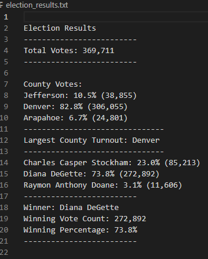

# Election_Analysis_and_Audit

## Project Overview and Purpose: Election Audit 

A Colorado Board of Elections staff member, Tom, has asked us to complete an election audit of a recent local congressional election. The purpose of this analysis is  two-fold: 1) to summarize the outcomes of the recent election and 2) to develop code that can be automated and leveraged for future election analysis and audits.

## Election Audit Overview of Methods

To begin the analysis, a .csv file was provided that included the following for each vote cast: voter identifaction number, voter's county, and voter's candidate choice (i.e., name). Python was used to read the datafile and Python code was written to run the analysis using Visual Studio Code as the programming platform. The primary goal of the analysis was to summarize outcomes of the recent election with a secondary goal of writing code that could be applied to future election analysis and audits. 

The following steps were taken to obtain results for the Board of Elections Commision:
1. Calculated the total number of votes cast.
2. Compiled a complete list of candidates who received votes in this recent local congressional election.
3. Calculated the total number of votes that each candidate received.
4. Calculated the percentage of votes that each candidate won.
5. Determined the winner of the election based on popular vote.

### Resources Used for Election Audit:
- Data Source: election_results.csv
- Software: Python 3.10.1, Visual Studio Code 1.68.1
  
## Election Audit Results:

Summarized below are the findings from the analysis: 
- There were 369,711 total votes cast in this election.

- Voters came from the following three counties:
  - Jefferson 
  - Denver
  - Arapahoe

- By county, the percentage and total number of voters were:  
  - Jefferson County had 10.5% of voters for this election with 38,855 individials voting in this election.
  - Denver County had 82.8% of the voter share for this election with 306,055 individuals voting in this election.
  - Araphaoe County had 6.7% of voters for this election with 24,801 individuals voting in this election.

- Denver County contributed the highest percentage as well as total number of voters in this election.

- The candidates were as follows:
  - Charles Casper Stockham
  - Diana DeGette
  - Raymon Anthony Doane
  
 - The candidate results were:
  - Charles Casper Stockham received 23.0% of the vote and 85,213 votes.
  - Diana DeGette received 73.8% of the votes and 272,892 votes.
  - Raymon Anthony Doane received 3.1% of the vote and 11,606 votes.
  
 - The winner of the election was Diana DeGette. 
  - Diana DeGette received 73.8% of the vote and 272,892 votes.

##Election Audit Summary

The script developed for this audit can readily be applied to any .csv file with basic voter details such as was included in this file: unique voter identifier, county name, and candidate selected. If basic summary details are needed and the basic details (i.e., variables) are the same, the script can be directly; the file location would need to be updated (.csv file) as well as a new .txt file written for summary output.

This script could easily be adapted to be used for other elections. County could be replaced with state or municipality, for example. For readability, variable names could be modified to reflect the voting jurisdiction more clearly but the calculations and logic would not need to change. County could also be replaced with voting party preference. You could then determine of those voting, the percentage of individuals voting for a particular political party by county and for a particular candidate. If you simply wanted to look at the percentage and number of voters participating that claimed a party preference, this data could take the place of the candidate name field and the same code could be applied simply modifying the variable naming schema and the selected column from the .csv output.
